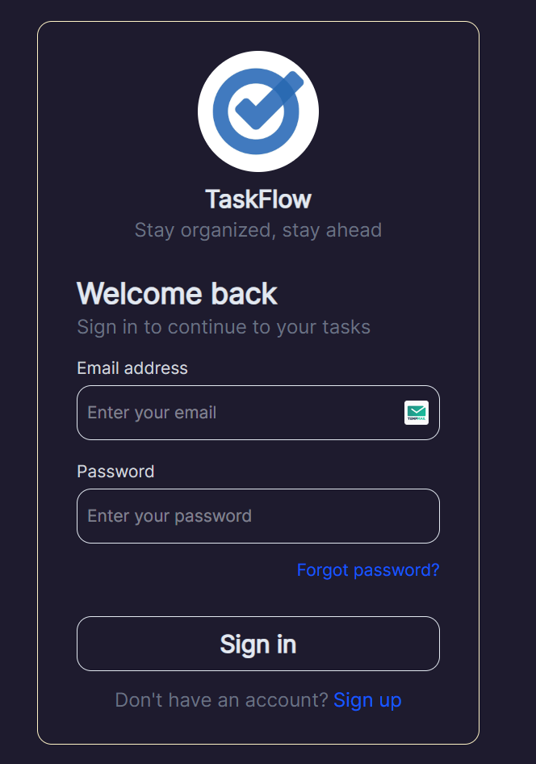
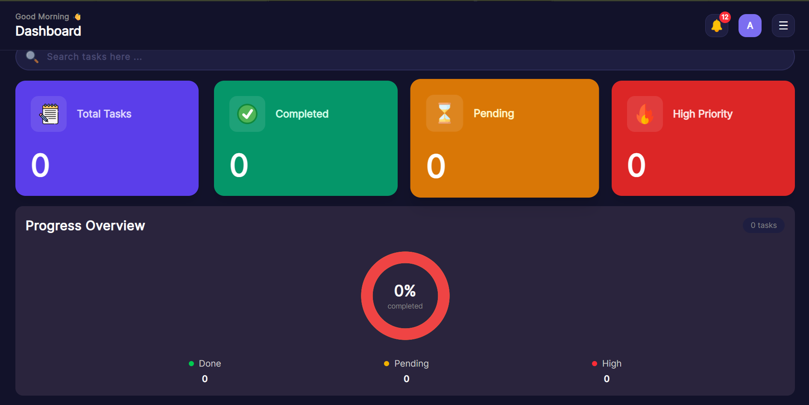
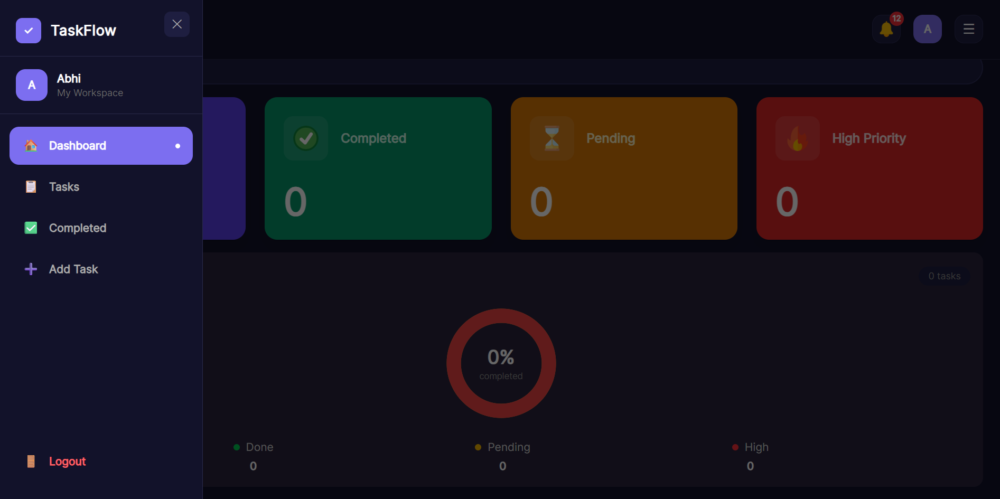
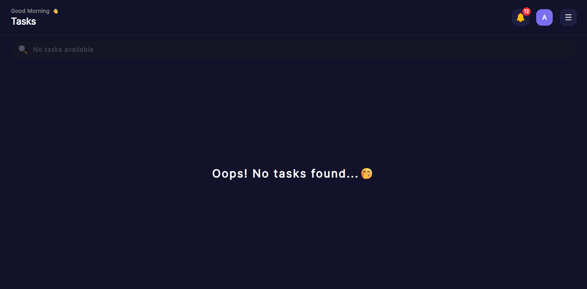
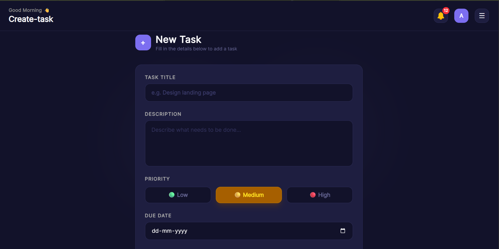
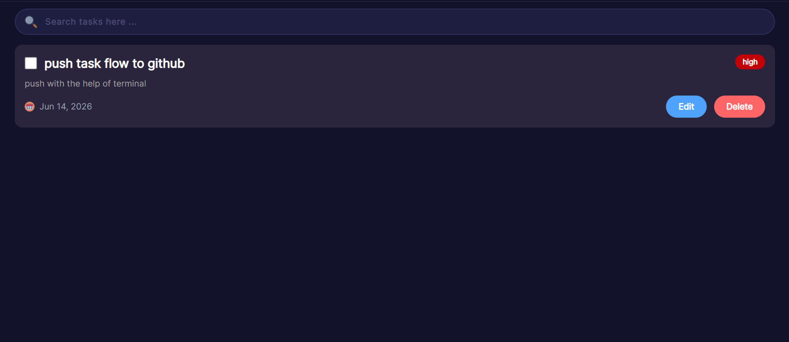
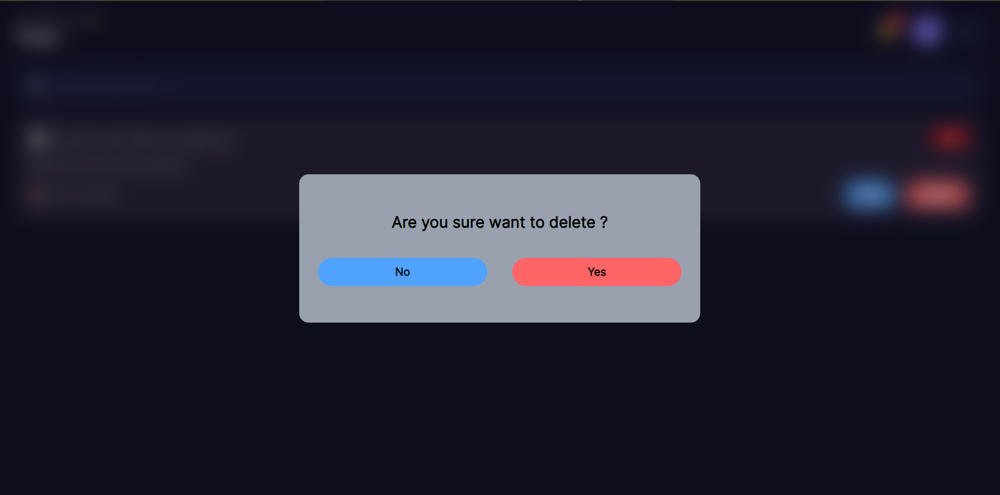

# 🚀 TaskFlow

TaskFlow is a modern full-stack task management application designed to help users organize, track, and manage tasks efficiently. It provides authentication, task statistics, task completion workflows, and an intuitive dashboard experience with real-time updates.

---

## ✨ Features

### 🔐 Authentication & Security

* User Signup and Login
* JWT-based Authentication
* Access Token & Refresh Token flow
* Password hashing with bcrypt

### 📝 Task Management

* Create tasks
* Edit existing tasks
* Delete tasks with confirmation modal
* Mark tasks as completed
* Set due dates
* Assign priority levels:

  * High
  * Medium
  * Low

### 📊 Dashboard Analytics

* Total Tasks count
* Pending Tasks count
* Completed Tasks count
* High Priority Tasks count
* Donut/Pie chart visualization for task statistics

### 🔍 Search Functionality

* Search tasks by title
* Search tasks by description
* Search completed tasks
* Dynamic search updates
* Disabled search when task list is empty

### 🎨 User Experience

* Responsive design
* Toast notifications
* Confirmation modal before deletion
* Real-time UI updates without page refresh
* Clean task status visualization

### 🔮 Upcoming Features

* Filter tasks by priority
* Advanced task filtering

---

## 🛠 Tech Stack

### Frontend

* React
* React Router DOM
* Tailwind CSS
* Axios
* React Hot Toast

### Backend

* Node.js
* Express.js
* PostgreSQL
* JWT Authentication
* bcrypt
* pg
* dotenv

---

## 📂 Project Structure

```bash
TaskFlow/
│
├── client/
│   ├── src/
│   │   ├── api/
│   │   ├── assets/
│   │   ├── components/
│   │   ├── pages/
│   │   ├── utils/
│   │   └── App.jsx
│   │
│   └── .env
│
├── backend/
│   ├── controllers/
│   ├── routes/
│   ├── middleware/
│   ├── db/
│   ├── utils/
│   ├── services.js
│   ├── server.js
│   └── .env
│
└── README.md

```

---

## LIVE View

## ⚙️ Installation

### Clone Repository

```bash
git clone "https://github.com/Abhisheksingh10734/task-manager.git"

cd TaskFlow
```

### Frontend Setup

```bash
cd frontend

npm install
```

Create `.env`

```env
VITE_API_URL=
```

Run frontend:

```bash
npm run dev
```

---

### Backend Setup

```bash
cd backend

npm install
```

Create `.env`

```env
PORT=

CLIENT_URL=

DB_USER=

DB_HOST=

DB_NAME=

DB_PASSWORD=

DB_PORT=

SALT_ROUNDS=

ACCESS_TOKEN_SECRET=

ACCESS_TOKEN_EXPIRY=

REFRESH_TOKEN_SECRET=

REFRESH_TOKEN_EXPIRY=
```

Run backend:

```bash
npm run dev
```

---

## 📡 API Routes

### Authentication

```http
POST /signup
POST /login
POST /logout
```

### Tasks

```http
GET    /app/tasks
POST   /app/tasks/create
PATCH  /app/tasks/:id
PATCH  /app/tasks/status/:id
DELETE /app/tasks/delete/:id
GET    /app/stats
```

---

## 📷 Screenshots









Example:

* Login Page
* Signup Page
* Dashboard
* Tasks Page
* Completed Tasks Page
* Statistics Dashboard
* 404 Page

---

## 🚧 Future Improvements

* Task filtering by priority
* Multiple task categories
* Email reminders
* User profile management
* Logout

---

## 🤝 Contributing

Contributions, issues, and feature requests are welcome.

Steps:

```bash
Fork repository

Create feature branch

git checkout -b feature/your-feature-name

Commit changes

git commit -m "feat: add new feature"

Push branch

git push origin feature/your-feature-name

Open Pull Request
```

---

## 📄 License

This project is licensed under the MIT License.

---

Made with ❤️ using React, Express and PostgreSQL
